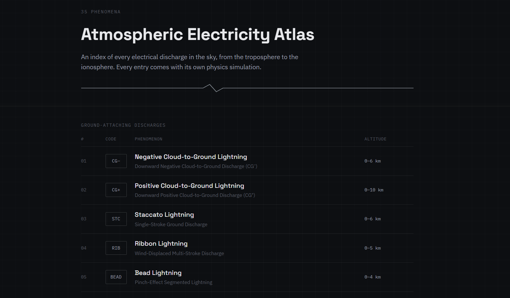
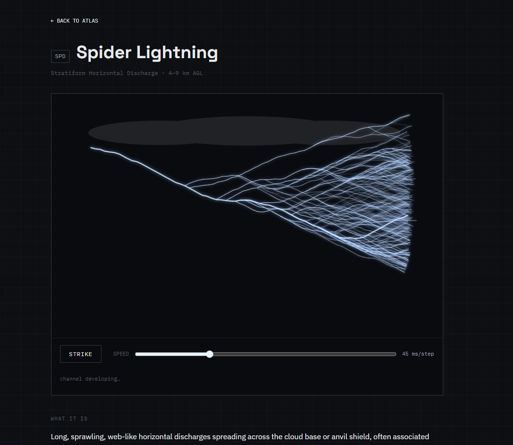
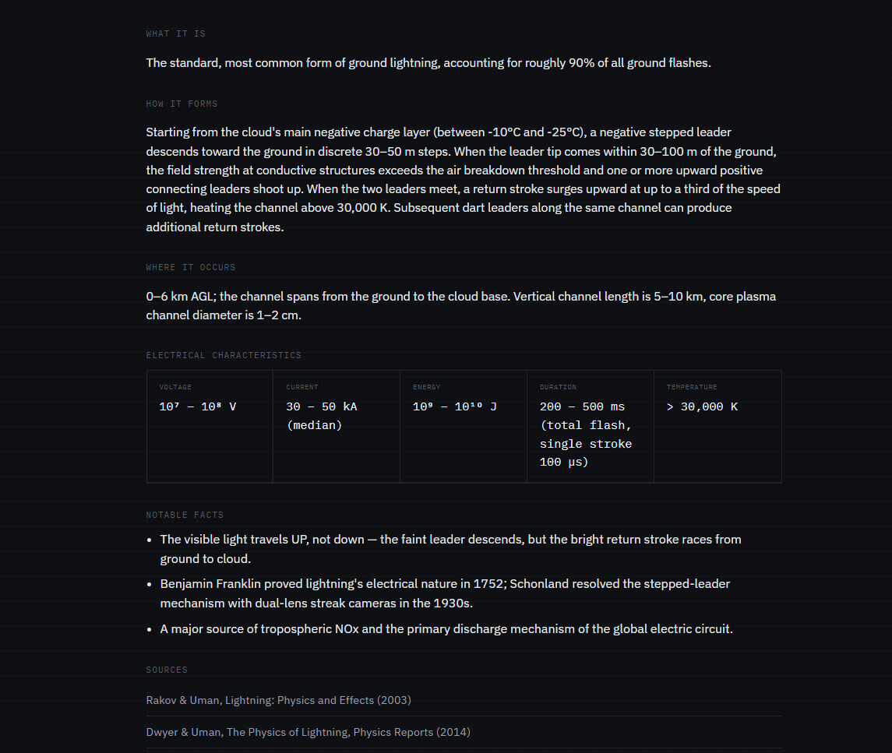

# Atmospheric Electricity Atlas

Interactive reference and visualization platform for atmospheric electrical phenomena.

  Live Demo:  
https://aliihsan1913.github.io/atmospheric-electricity-atlas/

---

## Overview

Most people think of lightning as a single phenomenon.

In reality, Earth's atmosphere hosts a diverse range of electrical events occurring at different altitudes, energies and scales. Some occur inside thunderstorms, some propagate above storm systems, while others involve plasma formation, ionization processes or large-scale atmospheric electrical systems.

Atmospheric Electricity Atlas was created to collect, organize and visualize these phenomena in a single engineering-oriented reference platform.

Each entry combines:

- Interactive visualizations
- Formation mechanisms
- Electrical characteristics
- Atmospheric context
- Scientific references

allowing visitors to explore how atmospheric electrical phenomena form, behave and differ from one another.

---

## Gallery

### Atlas Overview

---

## Included Categories

### Classical Lightning

- Cloud-to-Ground Lightning (CG−)
- Positive Lightning (CG+)
- Intracloud Lightning
- Intercloud Lightning
- Cloud-to-Air Lightning
- Spider Lightning
- Bolt from the Blue
- Anvil Crawlers
- Staccato Lightning
- Ribbon Lightning
- Bead Lightning
- Rocket Lightning
- Forked Lightning
- Heat Lightning
- Dry Lightning
- Superbolts

### Rare Atmospheric Phenomena

- Ball Lightning
- St. Elmo's Fire
- Volcanic Lightning
- Thundersnow

### Transient Luminous Events (TLEs)

- Red Sprites
- Blue Jets
- Gigantic Jets
- ELVES
- Blue Starters
- Trolls
- Pixies
- Gnomes

### High-Energy Atmospheric Events

- Terrestrial Gamma-ray Flashes (TGF)
- Terrestrial Electron Beams (TEB)

### Atmospheric Electrical Systems

- Global Electric Circuit
- Fair-Weather Electric Field
- Corona Discharge
- Triboelectric Charging
- Schumann Resonances

---

## What You Will Find

Each phenomenon page includes:

- A visual simulation
- Scientific explanation
- Formation mechanism
- Typical altitude range
- Electrical characteristics
- Notable facts
- Scientific references

---

## Motivation

As an Electrical and Electronics Engineering student, I have always been fascinated by the electrical phenomena visible in the sky during storms.

This project began as a personal effort to better understand those events, organize reliable information about them and create visual representations that make them easier to explore.

---

## Technology

- HTML5
- CSS3
- JavaScript
- Canvas API
- GitHub Pages

---

## References

Content is based on peer-reviewed literature, atmospheric electricity research and scientific publications from organizations and researchers working in lightning physics, transient luminous events and atmospheric electromagnetism.

Key references include:

- Rakov & Uman — *Lightning: Physics and Effects*
- Dwyer & Uman — *The Physics of Lightning*
- NOAA
- NASA
- AGU publications

---

## License

MIT License
